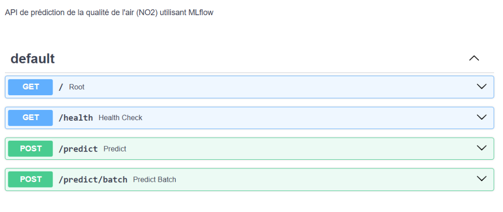
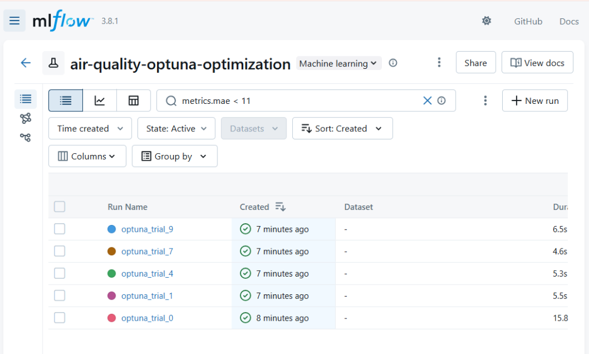
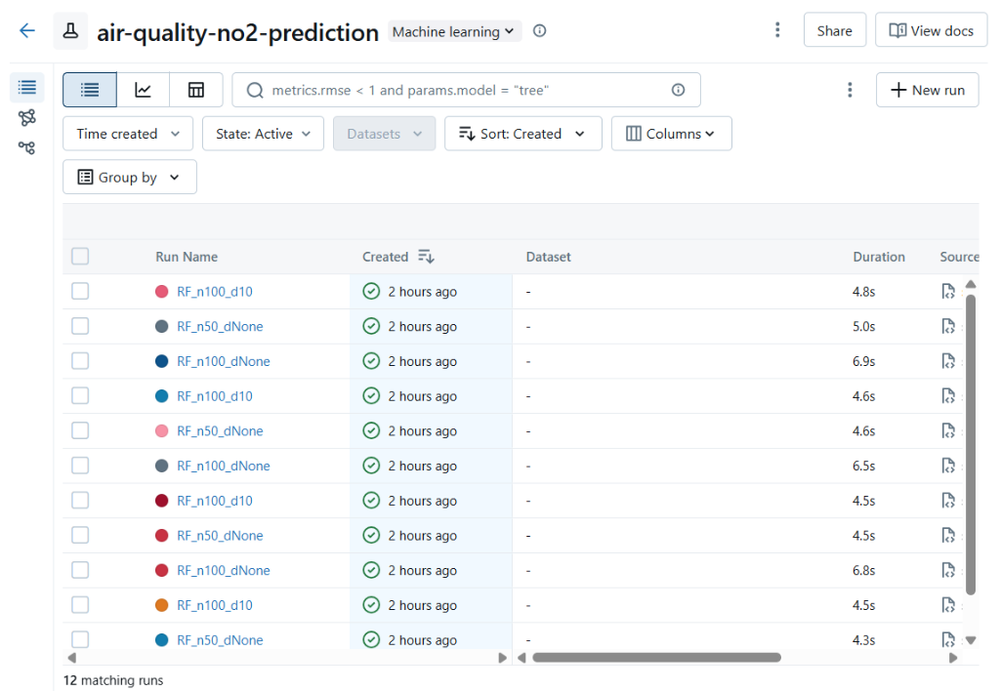
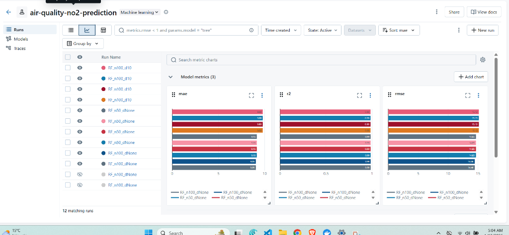
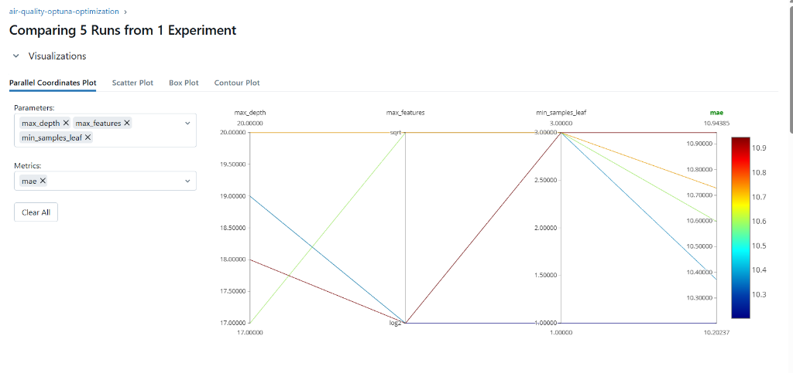

# 🌍 Air Quality NO2 Prediction - MLOps Project

[](https://github.com/manartrimeche/MLOp-Project/actions/workflows/ci.yml)
[](https://github.com/manartrimeche/MLOp-Project)
[](https://github.com/manartrimeche/MLOp-Project)
[](https://www.python.org/)
[](https://fastapi.tiangolo.com/)
[](https://mlflow.org/)
[](https://www.docker.com/)
[](LICENSE)

> **Système de prédiction de la concentration de dioxyde d'azote (NO2) dans l'air, implémentant un workflow MLOps complet de bout en bout.**

Ce projet démontre les meilleures pratiques MLOps, incluant l'entraînement de modèles, le tracking d'expériences, le déploiement d'API, la conteneurisation et l'automatisation CI/CD.

---

## 📑 Table des Matières

- [Fonctionnalités](#-fonctionnalités)
- [Architecture du Projet](#-architecture-du-projet)
- [Prérequis](#-prérequis)
- [Installation](#-installation)
- [Utilisation](#-utilisation)
  - [Développement Local](#développement-local)
  - [Docker (Production)](#docker-production)
- [Commandes Utiles (Makefile)](#-commandes-utiles-makefile)
- [Documentation](#-documentation)
- [Métriques du Modèle](#-métriques-du-modèle)

---

## 🚀 Fonctionnalités

*   **API RESTful (FastAPI)** : API performante pour servir les prédictions, documentée avec Swagger UI.
*   **MLOps Tracking (MLflow)** : Suivi complet des expériences, paramètres, et métriques. Registry de modèles pour la gestion des versions (Staging/Production).
*   **Data Versioning (DVC)** : Versionning des données pour la reproductibilité.
*   **Docker & Docker Compose** : Environnement complet conteneurisé (API + MLflow + Postgres).
*   **Qualité de Code** : Tests unitaires (pytest), couverture de code, linting (flake8, isort, black).
*   **CI/CD** : Pipelines GitHub Actions pour l'intégration continue.
*   **Automatisation** : Scripts pour la promotion de modèles et les tests de charge.

---

## 📂 Architecture du Projet

Le projet suit une structure MLOps standard :

```
MLOp-Project/
├── .github/              # Pipelines CI/CD
├── data/                 # Données (gérées par DVC)
├── docs/                 # Documentation détaillée
├── mflow_db/             # Base de données MLflow (Docker volume)
├── mlruns/               # Artifacts MLflow
├── models/               # Modèles sérialisés
├── scripts/              # Scripts d'utilitaire (promotion, tests)
├── src/                  # Code source (API, entraînement)
├── tests/                # Tests unitaires et d'intégration
├── .env.example          # Template des variables d'env
├── docker-compose.yml    # Orchestration des services
├── Dockerfile            # Image Docker pour l'API
├── Makefile              # Commandes d'automatisation
└── requirements.txt      # Dépendances Python
```

Pour une vue détaillée, voir [Project Structure](docs/PROJECT_STRUCTURE.md).

---

## � Captures d'écran

### Interface API (Swagger UI)

*Documentation interactive de l'API générée automatiquement.*

### Suivi des Expériences (MLflow)

*Comparaison des différentes runs d'optimisation.*


*Tableau de bord de suivi des expériences.*

### Analyse des Performances

*Visualisation des métriques (MAE, RMSE, R²) pour différents modèles.*


*Analyse des hyperparamètres (Parallel Coordinates Plot).*

---

## �📋 Prérequis

*   **Python 3.11+**
*   **Docker & Docker Compose**
*   **Git**

---

## 📦 Installation

Le projet utilise un **Makefile** pour simplifier toutes les tâches.

1.  **Cloner le dépôt :**
    ```bash
    git clone https://github.com/manartrimeche/MLOp-Project.git
    cd MLOp-Project
    ```

2.  **Configuration initiale (Installation + .env) :**
    ```bash
    make setup
    ```
    *Cette commande installe les dépendances et crée votre fichier `.env` à partir de `.env.example`.*

---

## 🛠 Utilisation

### Développement Local

1.  **Entraîner le modèle :**
    ```bash
    make train
    ```
    *Le modèle sera entraîné et loggé dans MLflow.*

2.  **Lancer l'API (avec rechargement à chaud) :**
    ```bash
    make api-reload
    ```
    *   API : [http://localhost:8000](http://localhost:8000)
    *   Docs API : [http://localhost:8000/docs](http://localhost:8000/docs)

3.  **Lancer l'interface MLflow :**
    ```bash
    make mlflow
    ```
    *   Dashboard : [http://localhost:5000](http://localhost:5000)

### Docker (Production)

Pour lancer toute la stack (API + MLflow) dans des conteneurs :

1.  **Démarrer les services :**
    ```bash
    make docker-up
    ```
    *(Attendre ~30 secondes pour l'initialisation de MLflow)*

2.  **Vérifier que tout fonctionne :**
    ```bash
    make test-api
    ```

3.  **Arrêter les services :**
    ```bash
    make docker-down
    ```

---

## 🔧 Commandes Utiles (Makefile)

Voici les commandes principales disponibles via `make help` :

| Commande | Description |
|----------|-------------|
| `make install` | Installe les dépendances Python |
| `make setup` | Installation complète + configuration .env |
| `make train` | Lance l'entraînement du modèle |
| `make api-reload` | Lance l'API en mode développement |
| `make test` | Lance les tests unitaires |
| `make test-cov` | Lance les tests avec rapport de couverture |
| `make format` | Formate le code (black, isort) |
| `make docker-up` | Lance les conteneurs Docker |
| `make promote-model` | Promeut le modèle récent en Production |
| `make test-api` | Teste l'API en cours d'exécution |

---

## 📚 Documentation

Une documentation complète est disponible dans le dossier `docs/` :

*   **[Guide API Complet](docs/api_guide.md)** : Détails des endpoints, exemples de requêtes.
*   **[Guide de Démarrage Rapide](docs/QUICK_SUMMARY.md)** : Résumé visuel pour démarrer en 2 minutes.
*   **[Rapport de Conformité](docs/COMPLIANCE_REPORT.md)** : Validation des exigences MLOps.
*   **[Index Documentation](docs/INDEX.md)** : Plan complet de la documentation.

---

## 📊 Métriques du Modèle

Performance du modèle actuel (Random Forest Regressor) :

- **MAE** : 9.05 µg/m³
- **RMSE** : 14.46 µg/m³
- **R²** : 0.9862
